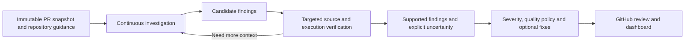

# Improving atmin review: evidence and next experiments

Research date: September 13, 2026. Recommendation, not an implemented engine
change. No review inference, paid benchmark, publication or deployment was run for
this research. The 35 reserved Martian cases remain unrun and their annotations
were not inspected.

The best next investment is a continuous investigation agent with efficient
repository navigation and targeted verification. Move administrative work out of
its investigation loop. Preserve atmin's GitHub integration, immutable snapshots,
reporting, rating policies and operational safeguards. Add complexity only when a
controlled experiment shows that it helps.

## What the evidence actually establishes

Our [15-PR comparison](martian-comparison-2026-09-11.md) used the same
`gpt-5.6-sol` model at medium reasoning on identical snapshots:

| Metric | atmin r02-24, local | Plain agent |
|---|---:|---:|
| Expected Core issues matched | 13/36 | 16/36 |
| Core F2 | 31.0% | 37.6% |
| Completed reviews | 13/15 | 15/15 |
| Median completed review | 6.1 minutes | 3.9 minutes |
| Completed within ten minutes | 8/15 | 15/15 |

This is an integration comparison, not proof that the controller prompt alone
caused the difference. Session continuity, tool interfaces, reporting obligations,
configuration and completion criteria differed. One trial per PR also leaves
run-to-run variation unresolved. Both arms were source-only and could not run
repository tests. Plain-agent completion does not certify semantic coverage.

The local adapter launches a new ephemeral Codex process for each tool batch and
replays a serialized visible transcript. The plain arm keeps one native session.
The production OpenAI adapter retains response output, including encrypted
reasoning content; OpenRouter retains the assistant message, including available
reasoning details. The local result therefore cannot establish the same deficit
for hosted API reviews. See [local adapter](codex-model.mjs),
[plain runner](plain-codex.mjs), [OpenAI adapter](../src/openai-model.ts) and
[OpenRouter adapter](../src/openrouter-model.ts).

The separate [r02-25 contract-ledger experiment](contract-investigation-2026-09-11.md)
is also informative: both engines caught all six seeded bug occurrences and both
produced two unsupported findings on clean controls. The candidate's median was
73.4 seconds versus 51.7 seconds, with 23.5% more reported input tokens. These were
three small defects, each repeated twice, not evidence of broad language coverage.
The extra ledger improved inspectability but demonstrated no accuracy benefit.
It was not used in the 15-PR comparison.

## What we are doing wrong

### 1. Our local integration interrupts the agent's normal working process

The repeated fresh sessions preserve visible source and messages but do not
preserve native continuation state. Each batch also requires tool arguments to be
encoded as a JSON string inside another JSON structure. These are avoidable
interface burdens; their isolated effect on detection has not yet been measured.

There is a demonstrated correctness defect too: the adapter rejected a successful
turn containing a `todo_list` event as unauthorized tool use. This produced a
partial Grafana review with no findings. Planning metadata should be handled
separately from execution events; actual forbidden execution must still fail.
Usage accounting should settle independently of final report parsing.

OpenAI documents supported SDK operations for starting, continuing and resuming
Codex threads. Use a supported session lifecycle rather than rebuilding an agent
from visible text on every batch. This does not require a particular new model.
[Official Codex SDK documentation](https://learn.chatgpt.com/docs/codex-sdk).

### 2. We confuse recorded reading with demonstrated understanding

The frozen r02-24 engine required reading both complete versions of changed files
before recording full coverage. It marked a localization review partial after the
agent inspected the changed entries but not every line of a roughly 12,000-line
file. Conversely, it missed invalid ERB with all 28 files marked reviewed.

Coverage is useful audit data, but byte coverage cannot certify behavioral
coverage. Record reads automatically. Describe which changed behaviors and
dependencies were investigated, and retain explicit gaps, without requiring the
model to submit a form after every file. Full-file reading should remain available
when needed; it should not be a universal completion requirement.

The toolset compounds this issue: 200-line reads, literal-only search, a repository
search capped at 50 paths with no pagination, and search results that require
another read to become evidence. These choices can force extra navigation and
repeated context. Their individual costs need an ablation, not an assumption that
every bound is bad. Prefer useful context windows, regex/path filters, paginated
results and automatically captured revision/line provenance.

Anthropic recommends retrieving relevant context as needed instead of loading
everything, and treating tool interfaces as part of model performance.
[Context engineering](https://www.anthropic.com/engineering/effective-context-engineering-for-ai-agents),
[tool design](https://www.anthropic.com/engineering/writing-tools-for-agents).
The SWE-agent paper also experimentally studies interface design, navigation and
execution feedback. It concerns code repair with older models, so its findings
support testing our interface rather than predict a review-score improvement.
[SWE-agent](https://arxiv.org/html/2405.15793v3).

### 3. We already request evidence, but citations do not validate an inference

Our prompt already asks for concrete triggers, affected consumers and
counterevidence. Adding those words again is unlikely to solve this.

In the contract experiment, both versions invented external consumers of an
internal export. The candidate attached real source citations to that unsupported
assumption. In the Cal.com review, atmin read the non-atomic update but did not
report the lost-update risk. These are reasoning and selection failures even when
the relevant source was available. See the [source audit](martian-audit-2026-09-11.md).

The useful unit of investigation is a falsifiable behavioral claim:

- Which actual caller, input, configuration or interleaving reaches this code?
- What fails at head, and why did the corresponding behavior work at base?
- Does the repository's framework, dependency version or configuration invalidate
  that interpretation?
- What source trace or executable check supports the consequence?

An unchanged caller is one kind of evidence, not a universal requirement: a
documented public API, persisted data format or supported protocol can establish a
real compatibility obligation without a checked-in consumer. An export alone
does not prove that obligation. Unknown impact should stay unknown.

### 4. We ask one investigation to do too many jobs, without execution feedback

The agent investigates defects while managing finding schemas, evidence IDs,
whole-file completion, subjective quality criteria, conventions and optional fix
eligibility. These product features matter, but mixing them into the discovery
loop is an unproven burden. The ledger experiment warns against adding more
mandatory records simply because they sound rigorous.

Keep early finding checkpoints so interruptions preserve useful work. Move
rating, presentation and optional patch generation after investigation. A finding
should survive a failure in a later rating or formatting stage; the overall result
must still disclose incomplete work.

Give the reviewer selective execution feedback in a separate sandbox. Our ERB
audit found a syntax defect with template compilation followed by `ruby -c`;
neither source-only reviewer caught it. That check did not boot the historical
application and should not be presented as full application validation.

Language awareness should initially mean selecting the repository's existing
parser, compiler, linter and relevant tests, plus looking up framework contracts.
It need not mean a separate expert agent or a large prompt for every language.
Run comparable checks on base and head, with the same intended environment, and
distinguish setup failure, existing failure and introduced regression. A generated
test must express a supported contract; making a test fail is not itself proof.
Source reasoning remains valid evidence when execution is impractical.

## What the external research adds

These sources describe mechanisms worth testing. Vendor reports are not
independent head-to-head evaluations, and their production metrics are not Martian
recall or proof of causality for our engine.

| Primary source | Relevant observation | Implication for atmin |
|---|---|---|
| [Cursor: Building a better Bugbot](https://cursor.com/blog/building-bugbot), January 15, 2026 | Describes earlier repeated passes, deduplication and validation, then a shift to autonomous investigation and dynamic context. Reports that the agentic version needed more encouragement to investigate, not just stricter suppression. | Encourage exploration of candidates; apply publication scrutiny afterward. Test whether filtering removes real bugs as well as noise. |
| [Greptile v3](https://www.greptile.com/blog/greptile-v3-agentic-code-review), November 26, 2025 | Describes recursive repository exploration and checking hypotheses with newly discovered context. | Follow a dependency beyond the first caller when evidence demands it. Our engine already loops; merely calling it agentic is not the missing feature. |
| [Greptile v5](https://www.greptile.com/blog/greptile-v5), August 5, 2026 | Describes narrowly scoped agents, each investigating one potential bug hypothesis. | Focused hypothesis investigation is a credible later experiment. A swarm is not a prerequisite for repairing our single-agent baseline. |
| [Greptile TREX](https://www.greptile.com/blog/trex), June 15, 2026 | Describes sandboxed execution with logs, traces and reproduction artifacts attached to findings. | Verify suspicious behavior and retain evidence the developer can inspect. Its claimed improvement is vendor-reported, not our expected uplift. |
| [CodeRabbit tool catalog](https://docs.coderabbit.ai/tools/list), accessed September 13, 2026 | Documents language- and configuration-aware selection of linters, security analyzers and CI tools. | Reuse appropriate deterministic checks; avoid spending model attention reproducing compiler work or emitting duplicate lint comments. |
| [Anthropic: Demystifying evals](https://www.anthropic.com/engineering/demystifying-evals-for-ai-agents), accessed September 13, 2026 | Recommends repeated trials, balanced cases, outcome grading and calibration of model judges with humans. | Include clean controls and source adjudication. Treat the complete integration as the evaluated system. |

The sources do not agree on one universal architecture: some favor simple loops,
others scoped parallel work. Their common practical lesson is to make exploration
effective, seek evidence, and measure added machinery. Our own failed ledger
experiment is stronger evidence against promoting that particular feature than
generic enthusiasm for more structured workflows.

## Proposed product flow

Start with one investigation agent and the simplest useful tools. Verification
can initially happen within that session. Test a separate candidate verifier
later; another model agreeing is not independent proof. Attach the candidate,
snapshot, relevant source and checks, and allow rejection or uncertainty. Measure
supported findings incorrectly rejected as well as unsupported ones removed.

The controller should own deterministic concerns: snapshot identity, sandbox
access, source anchors, trace capture, accounting, deduplication checks, lifecycle
and presentation. The model should focus on understanding changed behavior and
its consequences. Quality assessment still needs source evidence beyond the
defect list; run that assessment after discovery rather than deriving it solely
from priorities. Preserve the user's configurable net-positive rating policy.

Keep a clear distinction between completion, defect severity, evidence strength
and subjective quality. No findings does not establish correctness or a 5/5.

## Experiment order

Use small diagnostic cases to debug infrastructure, then retain every scheduled
trial on the full 15-case development split. Predeclare comparisons before running
them. Keep model, effort, source, available tools and budgets fixed except for the
factor under test. If an integration change necessarily changes multiple factors,
record that explicitly rather than label it a clean ablation.

| Order | Change | Question and acceptance evidence |
|---|---|---|
| 1 | Repair event parsing, stream lifecycle telemetry and preserve usage on parse failure. | Normal planning events cannot terminate a successful review. Validate with recorded events and deterministic tests before spending inference. |
| 2 | Preserve local session continuity; initially retain the existing review instructions and tool interface. | Does continuation improve completion, latency or supported detections? Compare against the frozen r02-24 integration and plain agent. |
| 3 | Move manual read-coverage bookkeeping and quality work out of discovery. Test these separately if claiming their individual effects. | Does reducing administrative work help investigation? Completion must describe scope honestly and retain findings after later-stage failure. |
| 4 | Improve source navigation and provenance capture. | Do relevant consumers become easier to locate, with fewer redundant reads and no loss of evidence integrity? |
| 5 | Add targeted syntax/type/test execution in an appropriately isolated environment. | Which additional real regressions are detected? Do checks distinguish base failures from new defects and avoid duplicate comments? This is a new execution-capable benchmark track. |
| 6 | Test a focused verifier, then model choice or extra investigation passes as separate experiments. | Do we gain supported findings at acceptable cost without suppressing valid uncommon bugs? Do not bundle a new model with workflow changes. |

Start repeated development comparisons with three trials per arm/case for a
promising candidate, reporting variability rather than treating three as a
statistical guarantee. Compare gained and lost detections by PR and bug class.
Only freeze and run the 35 reserved cases after the development decision; once
inspected, those cases cannot remain a reusable untouched test set. Maintain fresh
cases over time. Do not quietly rerun only disappointing outcomes.

## Measurement needs repair alongside the reviewer

Keep the historical upstream score unchanged. In a separately versioned protocol,
evaluate published findings without turning operational status or counterevidence
into additional bug claims. Preserve a compound finding's meaning. Apply the same
extraction rules to every arm. This can first be checked on saved reports without
new review inference.

Our audit found valid extra findings absent from the expected list, questionable
expected findings, and extraction/matching disagreements. It also found clear
misses. Neither treating every unmatched candidate as wrong nor excusing them all
is defensible. Preserve the raw Martian metric and add a source-adjudicated view
with supported, unsupported and unresolved findings, plus explicit disagreements.
An independent reviewer should adjudicate consequential label disputes before
public accuracy claims; this research is not independent human adjudication.

Build paired defect/clean cases for broad classes: concurrency and shared state,
producer/consumer compatibility, framework conventions, null/error behavior,
authorization, lifecycle and persistence. Select new cases independently of the
specific misses already debugged. Prefer executable oracles where feasible;
safe internal refactors and explicitly supported public API breaks both belong.

Track recall, adjudicated precision, false alarms on clean PRs, completed reviews,
median and tail latency, cost, and repeat stability. Keep missing usage visible.
For latency, capture request start, first event, last event, retries/reconnects,
tool time and finalization time. Do not label an opaque provider pause as thinking
time. Keep compact evidence and execution artifacts; private reasoning is not
needed for this telemetry.

Our next success criterion is matching or beating the plain baseline consistently
while improving unsupported-comment rate and reliable completion. Merely reaching
its 44.4% raw recall would not make the product competitive. Current competitor
ranking requires fresh comparable runs with equivalent source access, indexing,
settings and observation windows; the articles above cannot supply that ranking.

## Immediate implementation boundary

The next implementation should repair the local adapter and establish a credible
continuous-session baseline. The investigation/verification experiments follow
that baseline. Do not deploy r02-25 as an accuracy improvement, build a graph
database, add language-specific agent fleets, or fine-tune a model on these 15
cases based on the current evidence.

Existing product infrastructure remains useful. The main engineering correction
is to make the reviewer spend its effort investigating and testing behavior, and
to require evidence that each additional feature improves that work.
